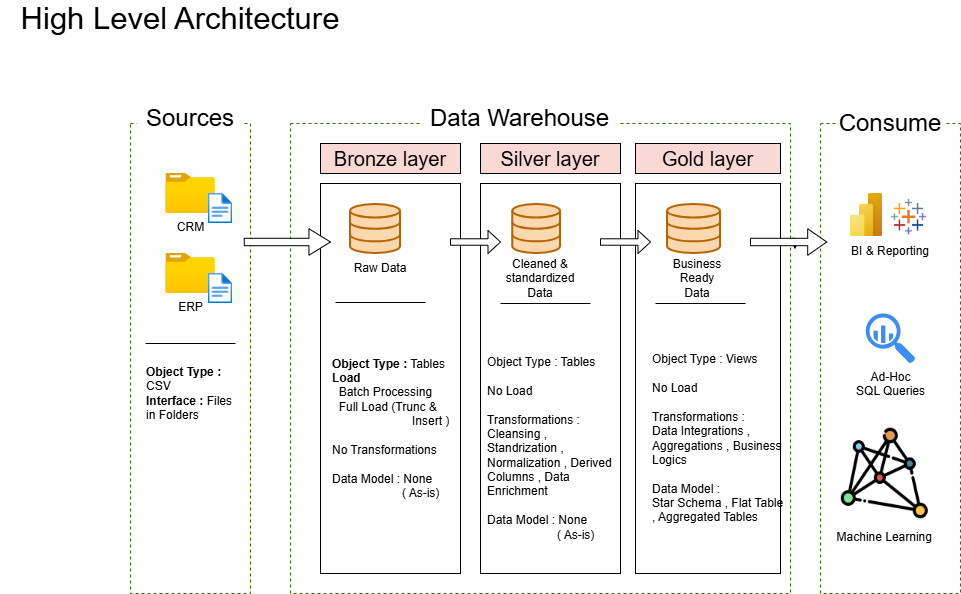

# SQL Data Warehouse & ETL Project

## Project Overview

This project is an end-to-end **Data Engineering and Data Warehouse project built using SQL Server and SQL Server Management Studio (SSMS)**.

The project takes raw data from **CRM and ERP sources**, processes it through a **Medallion Architecture (Bronze → Silver → Gold)**, performs data cleaning and transformation, integrates related datasets, and creates a business-ready analytical model in the Gold layer.

The final Gold layer is organized as a **Star Schema** with:

- `gold.dim_customers`
- `gold.dim_products`
- `gold.fact_sales`

The project was implemented using **SQL in SQL Server / SSMS**.

---

## Architecture

```text
                CRM DATA              ERP DATA
                   │                    │
                   └─────────┬──────────┘
                             ▼
                    ┌─────────────────┐
                    │  BRONZE LAYER   │
                    │    Raw Data     │
                    └────────┬────────┘
                             │
                       SQL Transformations
                             │
                             ▼
                    ┌─────────────────┐
                    │  SILVER LAYER   │
                    │ Cleaned &       │
                    │ Standardized    │
                    │ Data            │
                    └────────┬────────┘
                             │
                       SQL Transformations
                             │
                             ▼
                    ┌─────────────────┐
                    │   GOLD LAYER    │
                    │  Star Schema    │
                    └────────┬────────┘
                             │
                             ▼
                    Analytics / Reporting
```

### Architecture Diagram



---

# Source Data

The project combines data from two source systems: **CRM** and **ERP**.

## CRM Data

The CRM source contains:

- Customer information
- Product information
- Sales transaction information

### CRM Bronze Tables

```text
bronze.crm_cust_info
bronze.crm_prd_info
bronze.crm_sales_details
```

## ERP Data

The ERP source contains:

- Customer information
- Customer location information
- Product category information

### ERP Bronze Tables

```text
bronze.erp_cust_az12
bronze.erp_loc_a101
bronze.erp_px_cat_g1v2
```

---

# 🥉 Bronze Layer

The Bronze layer is the **raw data layer** of the project.

Source data is loaded into Bronze tables before applying the main transformation and cleansing logic.

### Bronze Tables

| Table | Description |
|---|---|
| `bronze.crm_cust_info` | CRM customer data |
| `bronze.crm_prd_info` | CRM product data |
| `bronze.crm_sales_details` | CRM sales data |
| `bronze.erp_cust_az12` | ERP customer data |
| `bronze.erp_loc_a101` | ERP location data |
| `bronze.erp_px_cat_g1v2` | ERP product category data |

### Bronze Scripts

```text
scripts/bronze/
├── ddl_bronze.sql
└── proc_load_bronze.sql
```

---

# 🥈 Silver Layer

The Silver layer contains **cleaned, standardized, and transformed data**.

The Bronze-to-Silver ETL process is implemented through:

```text
silver.load_silver
```

The procedure refreshes the Silver tables and loads transformed data from the Bronze layer.

## Customer Data Cleaning

For `silver.crm_cust_info`, the project:

- Removes duplicate customer records
- Keeps the latest customer record using `ROW_NUMBER()`
- Removes unwanted spaces from first and last names
- Standardizes marital status
- Standardizes gender values
- Handles missing or unknown values

### Marital Status

```text
S → Single
M → Married
Other → n/a
```

### Gender

```text
F → Female
M → Male
Other → n/a
```

---

## Product Data Transformation

For `silver.crm_prd_info`, the project:

- Extracts and transforms category IDs
- Transforms product keys
- Handles missing product costs
- Standardizes product-line values
- Converts product dates to the required date format
- Creates product validity periods using `LEAD()`

The product end date is derived from the next product start date.

```text
Current Product Start Date
          ↓
Next Product Start Date
          ↓
End Date = Next Start Date - 1 day
```

---

## Sales Data Cleaning

For `silver.crm_sales_details`, the project:

- Validates order, shipping, and due dates
- Converts valid dates into date values
- Handles invalid date values
- Validates sales amounts
- Recalculates incorrect sales amounts using quantity and price
- Handles invalid prices
- Derives price when required

The sales validation follows the relationship:

```text
Sales Amount = Quantity × Price
```

---

## ERP Customer Transformation

For `silver.erp_cust_az12`, the project:

- Standardizes customer IDs
- Removes the `NAS` prefix where required
- Handles invalid future birth dates
- Standardizes gender values

Example:

```text
NAS12345
   ↓
12345
```

---

## ERP Location Transformation

For `silver.erp_loc_a101`, the project:

- Removes hyphens from customer IDs
- Standardizes country values
- Handles missing country values

Examples:

```text
DE  → Germany
US  → United States
USA → United States
```

---

## ERP Product Category

For `silver.erp_px_cat_g1v2`, the project loads the product category information into the Silver layer for integration with CRM product data.

---

# Silver ETL Process

The Silver loading process follows a **full-refresh approach**.

```text
Bronze Tables
      ↓
TRUNCATE Silver Tables
      ↓
Transform & Clean Data
      ↓
Insert Into Silver Tables
      ↓
Silver Layer
```

The procedure also includes:

- Batch start and end time
- Table-level load duration
- Error handling using `TRY...CATCH`

### Silver Scripts

```text
scripts/silver/
├── ddl_silver.sql
└── proc_load_silver.sql
```

---

# 🥇 Gold Layer

The Gold layer contains the **final business-ready analytical views**.

The Gold layer combines information from the Silver tables and presents it in a **Star Schema structure**.

### Gold Objects

```text
gold.dim_customers
gold.dim_products
gold.fact_sales
```

---

# Customer Dimension

### `gold.dim_customers`

The customer dimension combines data from:

```text
silver.crm_cust_info
        +
silver.erp_cust_az12
        +
silver.erp_loc_a101
```

It contains:

- Customer key
- Customer ID
- Customer number
- First name
- Last name
- Country
- Marital status
- Gender
- Birth date
- Customer creation date

### Customer Key

A `customer_key` is generated using:

```sql
ROW_NUMBER() OVER (ORDER BY cst_id)
```

This provides a warehouse-level key for analytical relationships.

### Gender Integration

The Gold customer view uses CRM gender first and falls back to ERP gender when the CRM value is unavailable.

```text
CRM Gender
    ↓
If unavailable
    ↓
ERP Gender
    ↓
If unavailable
    ↓
n/a
```

---

# Product Dimension

### `gold.dim_products`

The product dimension combines:

```text
silver.crm_prd_info
        +
silver.erp_px_cat_g1v2
```

It contains:

- Product key
- Product ID
- Product number
- Product name
- Category ID
- Category
- Subcategory
- Maintenance
- Cost
- Product line
- Start date

Only currently active products are included:

```sql
WHERE prd_end_dt IS NULL
```

A `product_key` is generated using `ROW_NUMBER()`.

---

# Sales Fact

### `gold.fact_sales`

The sales fact combines sales transactions with the customer and product dimensions.

```text
silver.crm_sales_details
          │
          ├──────────────► gold.dim_products
          │                    │
          │                    ▼
          │               product_key
          │
          └──────────────► gold.dim_customers
                               │
                               ▼
                          customer_key
```

The fact contains:

| Column | Description |
|---|---|
| `order_number` | Sales order number |
| `product_key` | Product dimension key |
| `customer_key` | Customer dimension key |
| `order_date` | Order date |
| `shipping_date` | Shipping date |
| `due_date` | Due date |
| `sales_amount` | Sales amount |
| `quantity` | Quantity sold |
| `price` | Selling price |

---

# ⭐ Gold Star Schema

```text
                  ┌────────────────────┐
                  │  dim_customers     │
                  │────────────────────│
                  │ customer_key       │
                  │ customer_id        │
                  │ customer_number    │
                  │ first_name         │
                  │ last_name          │
                  │ country            │
                  │ marital_status     │
                  │ gender             │
                  │ birthdate          │
                  │ create_date        │
                  └─────────┬──────────┘
                            │
                            │ customer_key
                            ▼
                    ┌───────────────┐
                    │   fact_sales  │
                    │───────────────│
                    │ order_number  │
                    │ product_key   │
                    │ customer_key  │
                    │ order_date    │
                    │ shipping_date │
                    │ due_date      │
                    │ sales_amount  │
                    │ quantity      │
                    │ price         │
                    └───────┬───────┘
                            │
                            │ product_key
                            ▼
                  ┌────────────────────┐
                  │   dim_products     │
                  │────────────────────│
                  │ product_key        │
                  │ product_id         │
                  │ product_number     │
                  │ product_name       │
                  │ category_id        │
                  │ category           │
                  │ subcategory        │
                  │ maintenance        │
                  │ cost               │
                  │ product_line       │
                  │ start_date         │
                  └────────────────────┘
```

> The Gold layer is implemented as **SQL views** that provide a Star Schema-style analytical model over the Silver data.

---

# 🔄 Complete Data Flow

```text
CRM + ERP Source Data
          ↓
      Bronze Layer
          ↓
    Data Cleaning
          ↓
   Data Standardization
          ↓
    Data Validation
          ↓
    Data Integration
          ↓
      Silver Layer
          ↓
 Customer Dimension
 Product Dimension
     Sales Fact
          ↓
       Gold Layer
          ↓
 Analytics / Reporting
```

---

# 🛠️ Technologies Used

- **Microsoft SQL Server**
- **SQL Server Management Studio (SSMS)**
- **SQL**
- **Stored Procedures**
- **SQL Views**
- **GitHub**
- **Draw.io** for architecture diagrams

The complete ETL and transformation logic for this project was implemented using **SQL in SQL Server**.

---

# 📁 Project Structure

```text
.
├── architecture/
│   └── data_architecture.png
│
├── datasets/
│
├── docs/
│   ├── data_flow_diagram.drawio (1).png
│   └── placeholder
│
├── scripts/
│   ├── bronze/
│   │   ├── ddl_bronze.sql
│   │   └── proc_load_bronze.sql
│   │
│   ├── silver/
│   │   ├── ddl_silver.sql
│   │   └── proc_load_silver.sql
│   │
│   ├── gold/
│   │   └── ddl_gold.sql
│   │
│   └── init_database.sql
│
└── README.md
```

---

# 📚 Key Data Engineering Concepts

This project demonstrates practical experience with:

- ETL pipeline development
- Data Warehousing
- Medallion Architecture
- Bronze / Silver / Gold layers
- Data cleaning
- Data validation
- Data standardization
- Data integration
- CRM and ERP data integration
- Stored procedures
- SQL views
- Fact and dimension modeling
- Star Schema
- Surrogate keys
- Business keys
- Window functions
- Full-refresh data loading
- Error handling
- Batch/load monitoring

---

# 📊 Analytical Use Cases

The Gold layer can support analysis such as:

### Customer Analysis

- Customer distribution by country
- Customer demographics
- Customer sales contribution
- Customer segmentation

### Product Analysis

- Product performance
- Category performance
- Subcategory performance
- Product-line analysis
- Product cost analysis

### Sales Analysis

- Total sales
- Sales by customer
- Sales by product
- Sales trends
- Quantity sold
- Price analysis

---

# 🚀 Future Improvements

Possible future improvements include:

- Incremental data loading
- Change Data Capture (CDC)
- ETL audit and logging tables
- Automated data-quality checks
- Query optimization and indexing
- Pipeline scheduling
- Power BI reporting
- Monitoring and alerting

---

# 👨‍💻 Author

**Siddhartha Reddy**

Aspiring Data Engineer

**Skills:** SQL • Data Engineering • ETL • Data Warehousing • Data Analytics

---

## Project Summary

This project demonstrates an end-to-end **SQL-based Data Engineering pipeline** that transforms CRM and ERP source data into clean, integrated, and analytics-ready data using:

```text
Bronze → Silver → Gold
```

The final Gold layer provides a **Star Schema-style analytical model** consisting of:

```text
gold.dim_customers
gold.dim_products
gold.fact_sales
```

